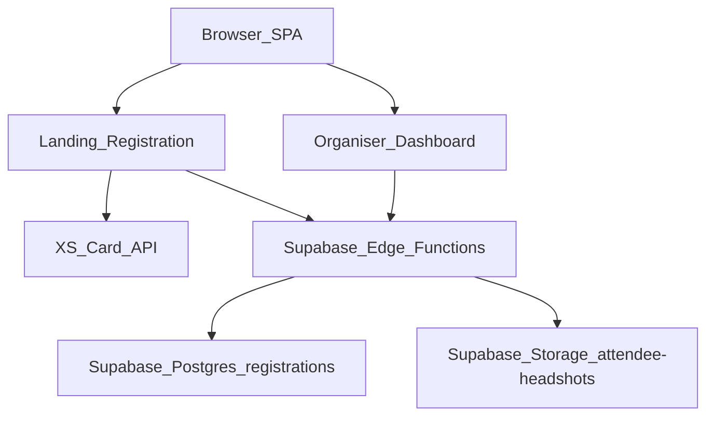

# JoGEDA Investment Conference 2026
## Technical Manual (Landing Page + Registration + Organiser Dashboard)

**Version**: 1.0  
**Last updated**: 2026-03-26  

---

## Audience
This manual is written for:
- **Organisers**: operating the dashboard during the event
- **Technical operations**: deploying and configuring the stack
- **Developers**: maintaining and extending the codebase

---

## Table of contents
1. Executive overview
2. System architecture
3. Configuration reference (env vars and secrets)
4. Deployment & domains
5. Operational guide (organisers)
6. Data model & consent rules
7. Troubleshooting (high-level)
8. Maintenance & extension points (developers)
9. Appendix (file map)

---

## 1) Executive overview

### 1.1 What this project does
This project provides:
- A public **landing page** describing the Joe Gqabi Investment Conference
- A multi-step **registration form** for delegates
- An organiser-only **admin dashboard** for:
  - listing attendees
  - verifying emails
  - checking attendees in via QR
  - exporting attendee lists
  - previewing/downloading consented headshots

### 1.2 Core systems
- **Frontend**: Vite + React + Tailwind
- **XS Card API**: creates user + card profile (registration flow)
- **Supabase**:
  - Postgres table `public.registrations`
  - Edge Functions in `supabase/functions/*`
  - Storage bucket `attendee-headshots` for consented headshots

### 1.3 Key user journeys
- Delegate registers → XS user created → registration mirrored into Supabase
- Organiser opens dashboard → verifies email → checks in attendee → downloads consented headshot if available

---

## 2) System architecture

### 2.1 Architecture diagram

### 2.2 Frontend entry points
- `index.html`: app metadata (title, description, favicon)
- `src/App.tsx`: view routing (`landing`, `registration`, `admin`) and install redirect handling
- `src/templates/Templates.tsx`: landing page + `RegistrationForm`
- `src/components/AdminGate.tsx`: organiser password gate
- `src/components/AttendeeDashboard.tsx`: attendee operations UI
- `src/components/QrScanner.tsx`: camera access + QR decode (`jsqr`)

### 2.3 Supabase Edge Functions (API surface)
Located in `supabase/functions/*`:
- `mirror-registration`: records registration in Supabase and optionally uploads consented headshot to Storage
- `list-attendees`: returns registrations for the dashboard
- `preview-headshot`: streams a consented headshot image from Storage
- `checkin-attendee`: check-in state changes
- `mark-email-verified`: verifies email upstream (XS) and updates Supabase state
- `export-attendees`: exports attendee list (CSV/XLSX/PDF)
- `user-status-proxy`: helper proxy to XS status endpoints

---

## 3) Configuration reference (no real secret values)

### 3.1 Frontend environment variables (Vite)
Set in `.env` (do not commit real secrets):
- `VITE_BASE_URL`: XS Card API base URL used by the registration flow (`src/templates/Templates.tsx`)
- `VITE_CONFERENCE_CODE`: conference identifier used by frontend and passed into Edge Functions (`src/templates/Templates.tsx`, `src/components/AttendeeDashboard.tsx`)
- `VITE_ADMIN_PASSWORD`: organiser dashboard password (`src/components/AdminGate.tsx`)
- `VITE_SUPABASE_URL`: Supabase project URL (frontend client usage)
- `VITE_SUPABASE_ANON_KEY`: Supabase anon key used to call Edge Functions (`src/templates/Templates.tsx`, `src/components/AttendeeDashboard.tsx`)
- `VITE_SUPABASE_FUNCTIONS_URL`: base URL for Edge Functions (`src/templates/Templates.tsx`, `src/components/AttendeeDashboard.tsx`)
- `VITE_GOOGLE_PLAY_URL`, `VITE_APPLE_APP_URL`: app store redirects (`src/App.tsx`, `src/templates/Templates.tsx`)
- `VITE_GA_ENABLED`: set to `true` only for production deployments where analytics is required
- `VITE_GA_MEASUREMENT_ID`: GA4 Measurement ID (example: `G-SXS8C877Y1`)
- `VITE_GA_ALLOWED_HOSTS`: comma-separated host allowlist for GA (example: `conference.example.com,www.conference.example.com`)
- `VITE_CONFERENCE_API_KEY` (if present): used by some server-side flows; avoid placing real values in docs

### 3.2 Supabase Edge Function secrets
Set as **Supabase Function secrets** (never in frontend `.env`):
- `SUPABASE_URL`
- `SUPABASE_SERVICE_ROLE_KEY`
- `BASE_URL` (XS API base URL for Edge Functions that call XS upstream)
- `ADMIN_API_KEY` (XS admin key used by `mark-email-verified`)
- `HEADSHOT_BUCKET` (optional; defaults to `attendee-headshots`)

Other function secrets referenced in code:
- `STATUS_BASE_URL` (optional fallback used by `user-status-proxy`)
- `CONFERENCE_API_KEY` / `VITE_CONFERENCE_API_KEY` (used by `user-status-proxy`)
- `ANON_KEY` (used by `checkin-attendee` when calling other Edge Functions)
- `EDGE_FUNCTIONS_BASE_URL` / `FUNCTIONS_BASE_URL` (used by `checkin-attendee`)

### 3.3 Alignment rule (common failure mode)
- `VITE_BASE_URL` (frontend) and Edge Function secret `BASE_URL` must point to the **same XS environment** (staging vs production). Misalignment can cause organiser actions like verify to fail.

---

## 4) Deployment & domains

### 4.1 Build and run scripts
See `package.json`:
- `npm run dev`: local dev server (Vite)
- `npm run build`: build frontend and bundle server
- `npm run start`: run bundled server output

### 4.2 Supabase Edge Function deployment checklist
Deploy functions when you change code under `supabase/functions/*`:
- `mirror-registration`
- `list-attendees`
- `preview-headshot`
- `checkin-attendee`
- `mark-email-verified`
- `export-attendees`
- `user-status-proxy`

---

## 5) Operational guide (organisers)

### 5.1 Accessing the dashboard
- From the landing page footer, organisers can open the dashboard via the subtle entry point (routes to `#admin`).
- The dashboard is gated by the Admin password prompt.

**Screenshot placeholder**: landing footer showing dashboard entry trigger.  

### 5.2 Dashboard: key actions
Inside **Attendee Management**:
- **Refresh List**: reload attendees
- **Register attendee**: opens embedded registration form modal
- **Verify** (3-dot menu): marks delegate email as verified (XS upstream + Supabase)
- **Check In** (3-dot menu): checks in a delegate
- **Open Scanner**: camera scanner to read attendee QR codes
- **Preview** (3-dot menu): headshot preview modal + download (consent-gated)
- **Export**: CSV/XLSX/PDF export

**Screenshot placeholder**: dashboard main view with attendee table and action buttons.  
**Screenshot placeholder**: 3-dot menu open (Verify / Check In / Preview).  
**Screenshot placeholder**: headshot preview modal with attendee details and Download button.  

### 5.3 Consent and headshot preview
- Preview is **disabled** unless:
  - `photo_consent = true`, and
  - `headshot_path` exists

### 5.4 Recommended event-day operating procedure
- **Start of day**
  - Open dashboard and click **Refresh List**
  - Confirm Wi‑Fi and device camera permissions for the check-in station
  - Test one QR scan end-to-end
- **During arrivals**
  - Use **Open Scanner** for QR check-in
  - If attendee is not checked in yet, use 3-dot **Check In**
  - If email is not verified, use **Verify** first
- **Badge/lanyard printing**
  - Only use headshots where **Preview** is available (consent-gated)
  - Download headshot from the preview modal

---

## 6) Data model & consent rules

### 6.1 Registrations table
Source of truth: Supabase Postgres table `public.registrations`.

Operationally important fields:
- **Identity**: `first_name`, `last_name`, `email`, `phone`, `organisation`, `title`
- **Consent**:
  - `photo_consent` (badge/lanyard/directory usage)
  - `photography_consent` (event photography/media)
- **State**:
  - `email_verified`, `email_verified_at`
  - `checked_in`, `checked_in_at`
- **Headshot storage**:
  - `headshot_path`, `headshot_uploaded_at`, `headshot_mime`

### 6.2 Consent rules
- Headshots are only uploaded/saved if `photo_consent=true` and a file is provided.
- Headshot preview/download must not be possible without consent.

---

## 7) Troubleshooting (high-level)
- **Edge Function payload mismatch**: if you see “Invalid payload …”, redeploy the function to match your local code.
- **Verify fails (“no user record”)**: most commonly an XS environment mismatch between frontend `VITE_BASE_URL` and function secret `BASE_URL`.
- **QR scanner issues**: confirm camera permissions, use HTTPS on mobile, ensure good lighting and focus.

---

## 8) Maintenance & extension points (developers)

### 8.0 Code map (high-signal)
- **SPA routing + install redirect**: `src/App.tsx`
  - Uses `?install=1` to redirect to the correct app store URL based on user-agent.
- **Landing page + registration**: `src/templates/Templates.tsx`
  - Multi-step registration, XS API calls, and mirroring to Supabase via `mirror-registration`.
- **Admin access gate**: `src/components/AdminGate.tsx`
  - Password gating using `VITE_ADMIN_PASSWORD` and `window.sessionStorage`.
- **Organiser dashboard**: `src/components/AttendeeDashboard.tsx`
  - Lists attendees (`list-attendees`), exports (`export-attendees`), check-in (`checkin-attendee`), verify (`mark-email-verified`), headshot preview (`preview-headshot`).
- **QR scanning**: `src/components/QrScanner.tsx`
  - Camera access (`getUserMedia`) + QR decode (`jsqr`).

### 8.1 Where to change UI
- Landing + registration: `src/templates/Templates.tsx`
- Dashboard: `src/components/AttendeeDashboard.tsx`
- Admin gate: `src/components/AdminGate.tsx`

### 8.2 QR scanner implementation
- Component: `src/components/QrScanner.tsx`
- Decode library: `jsqr`
- Camera: `navigator.mediaDevices.getUserMedia`

### 8.3 Adding new dashboard actions
- Add a new item in the 3-dot menu in `src/components/AttendeeDashboard.tsx`
- Add a matching Edge Function under `supabase/functions/<name>/index.ts` if server-side access is required
- Extend `public.registrations` and update `list-attendees` mapping if you add new columns displayed in the table

### 8.4 Extension patterns (recommended)
- **Add a new registration field**:
  - Add the form input in `src/templates/Templates.tsx`
  - Add a new column in `public.registrations`
  - Update `supabase/functions/mirror-registration/index.ts` to insert it
  - Update `supabase/functions/list-attendees/index.ts` to select/map it (if it appears in dashboard)
- **Add a new organiser action**:
  - Add an Edge Function if it must use the service role key
  - Call it from `src/components/AttendeeDashboard.tsx` with Supabase anon headers
  - Return user-friendly `{ ok, message }` errors from the function for toast display
- **Add a new downloadable asset type**:
  - Store the object path + mime in `public.registrations`
  - Gate preview/download based on consent + presence of storage path
  - Use a preview-style function (`preview-headshot`) to stream bytes to the browser

---

## 9) Appendix: file map
- `src/App.tsx`: SPA routing and install redirect
- `src/templates/Templates.tsx`: landing + multi-step registration
- `src/components/AttendeeDashboard.tsx`: organiser operations UI
- `src/components/QrScanner.tsx`: QR scanning
- `supabase/functions/*`: Edge Function API surface
